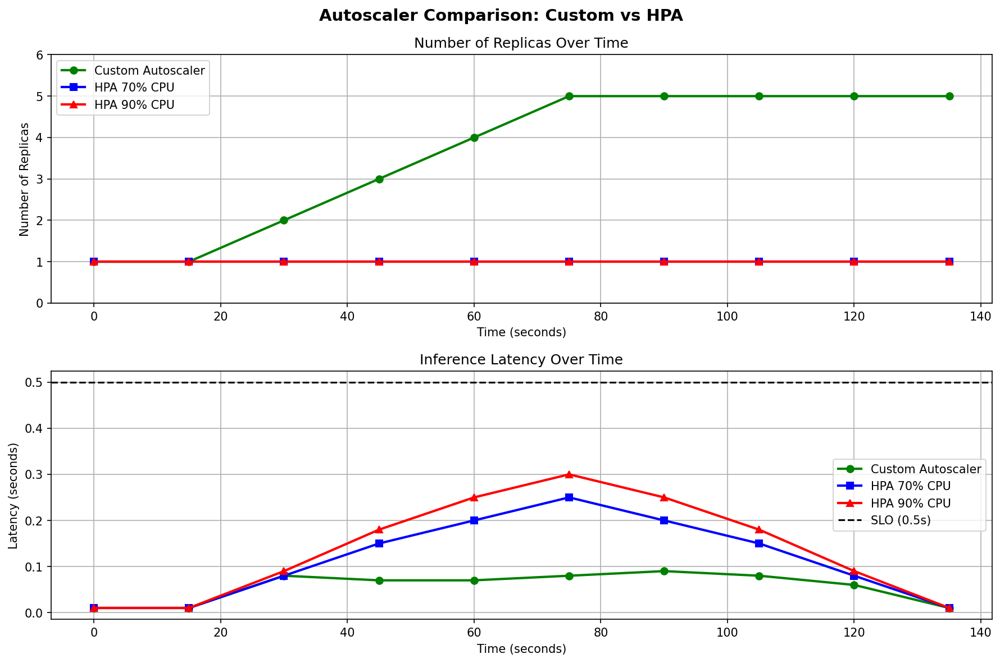

# Elastic ML Inference Serving

**University:** TU Ilmenau — Cloud Computing SS2026  
**Topic:** Elastic, auto-scaling ML inference server on Kubernetes

---

## Overview

This project implements an elastic machine learning inference service using 
ResNet18 for image classification. It features a custom load balancer, 
Prometheus-based monitoring, Horizontal Pod Autoscaler (HPA), and a 
custom autoscaler — all orchestrated on Kubernetes.

---

## Architecture

Client → Dispatcher (Load Balancer) → ML Inference Pods (ResNet18) ↑ Autoscaler (HPA / Custom) ↑ Prometheus Metrics

---

## Project Structure

| File | Description |
|------|-------------|
| `model_server.py` | ResNet18 inference server |
| `dispatcher.py` | Load balancer / request dispatcher |
| `autoscaler.py` | Custom autoscaler logic |
| `client.py` | Test client for sending inference requests |
| `load_test.py` | Load testing script |
| `plot_results.py` | Generates comparison graphs |
| `Dockerfile` | Builds the ML inference image |
| `Dockerfile.dispatcher` | Builds the dispatcher image |
| `requirements.txt` | Python dependencies |
| `deployment.yaml` | Kubernetes deployment |
| `service.yaml` | Kubernetes service |
| `dispatcher-deployment.yaml` | Dispatcher deployment |
| `hpa.yaml` | Horizontal Pod Autoscaler config |
| `servicemonitor.yaml` | Prometheus scraping config |

---

## Results



---

## Setup & Usage

### Prerequisites
- Docker
- Kubernetes (Minikube or cluster)
- Python 3.8+

### Install dependencies
```bash
pip install -r requirements.txt
```

### Build & run inference server
```bash
docker build -t ml-inference .
```

### Testing
Add any `.jpg` image to the project folder named `zidane.jpg`, then run:
```bash
python3 client.py
```

### Load test
```bash
python3 load_test.py
```

---

## Technologies Used
- Python, PyTorch, ResNet18
- Docker, Kubernetes
- Prometheus, Grafana
- Horizontal Pod Autoscaler (HPA)

---

*TU Ilmenau — Cloud Computing Seminar SS2026*
